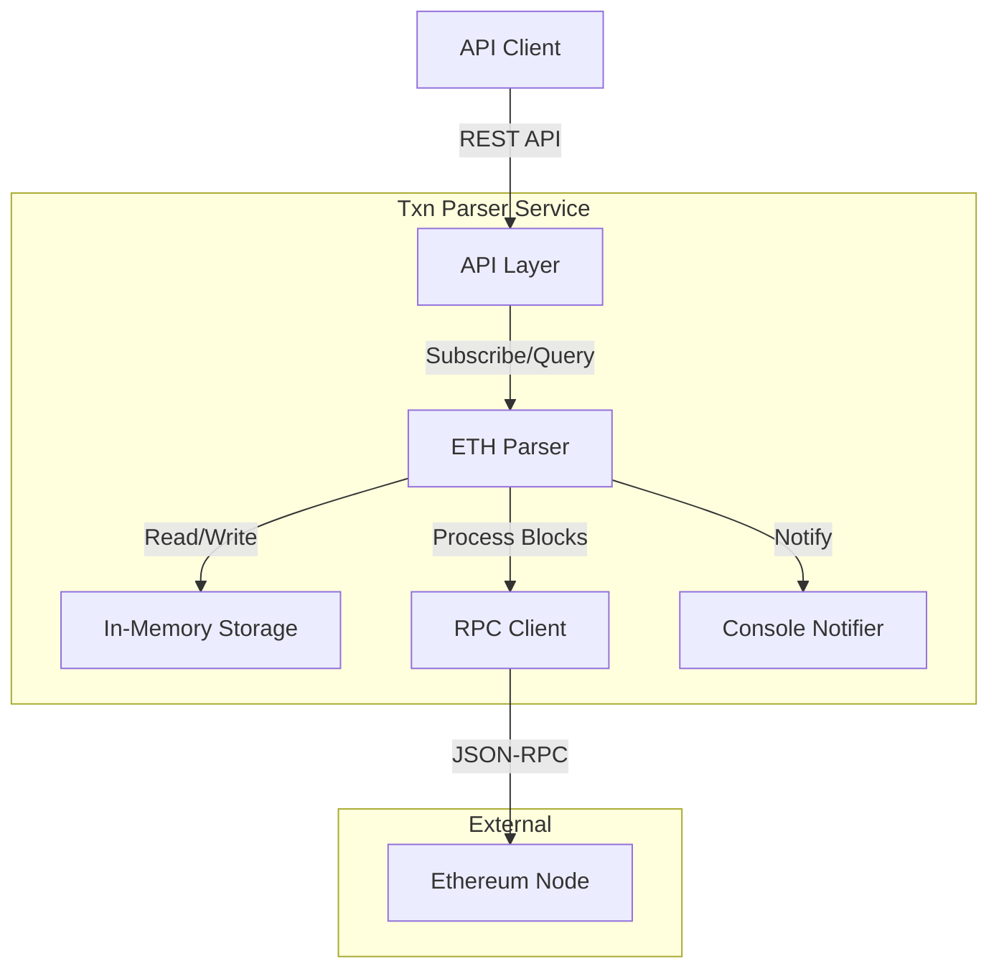
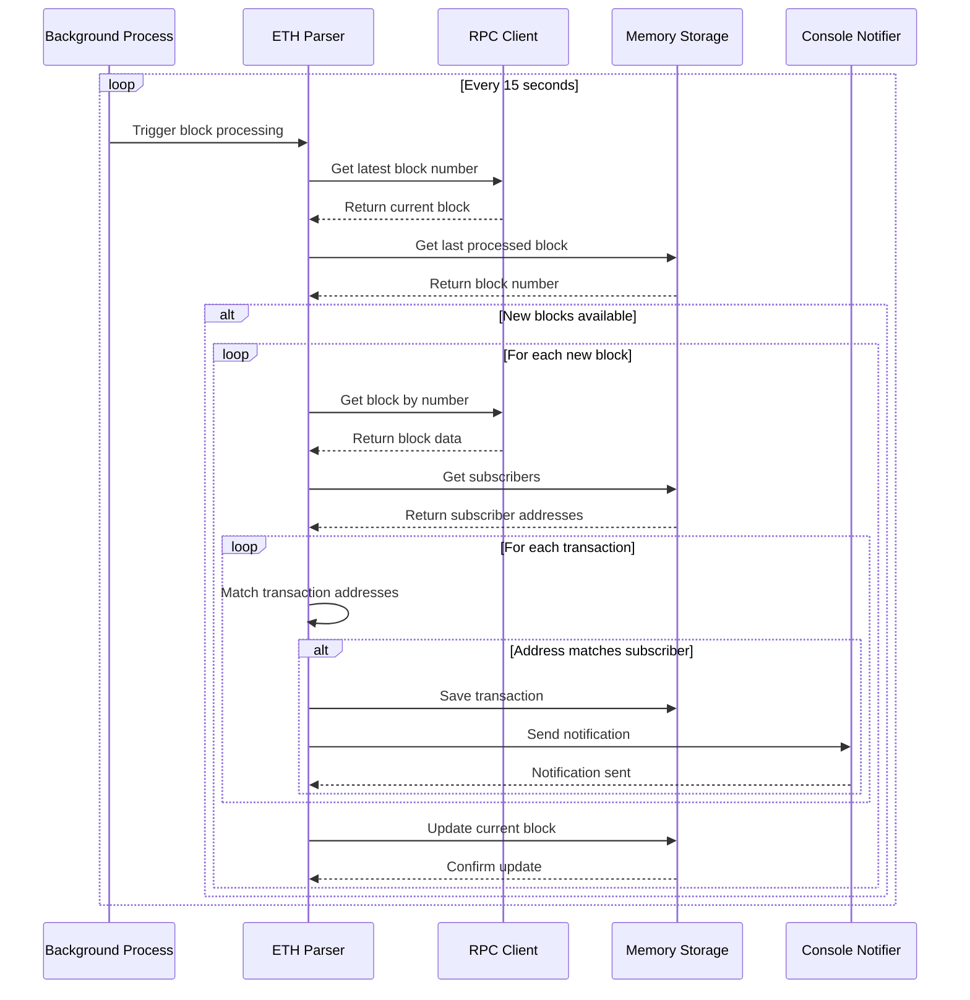

## Getting Started

### Installation

1. Clone the repository

```bash
git clone https://github.com/yourusername/tx-parser.git
cd tx-parser
```

2. Install dependencies

```bash
go mod download
```

3. Generate mocks (required for testing)

```bash
make mock
```

### Running the Application

1. Start the server in development mode:

```bash
make run
```

The server will start on `http://localhost:5005`

## Project structure

### Folder structure

```
tx-parser/
├── cmd/
│   └── server                # Application entry point
├── internal/
│   ├── api                   # HTTP API routes
│   ├── models                # Transaction model definitions
│   ├── parser                # Include Parser interface and Ethereum parser implementation
│   └── storage               # Storage interface
│       └── memory_storage.go # In-memory storage implementation
├── pkg/
│   ├── logger                # Logging utilities
│   ├── notification          # Notification interface to communicate with notification service
│   │   └── console.go        # Console notifier implementation - print any notify to console
│   └── rpc                   # RPC client interface and Ethereum RPC client
├── mocks                     # Generated mock files, ignored by git, need run `make mock`
├── Makefile                  # Build and development commands
├── go.mod                    # Go module file
├── go.sum                    # Go dependencies checksums
└── README.md                 # Project documentation
```

### Key Components

1. Command Layer (cmd/)

- Entry point for the application
- Server initialization and configuration

2. Internal Package (internal/)

- API: HTTP router and handlers
- Models: contains transaction data structure shared by parser and the api
- Parser: Core business logic for parsing Ethereum blocks. If no current block (current block is 0) we'll process from current latest block fetched from the RPC.
- Storage: Data persistence layer to support the Parser. Currently we have in-memory storage, evertime the server re-start data will be wipe-out.

3. Package Layer (pkg/)

- Logger: Logging utilities
- Notification: Notification utilities to communicate with notification service
- RPC: Ethereum JSON-RPC client

4. Build Tools:
   A makefile with commands for:

- Building: `make build`
- Develop: `make run`
- Testing: `make test`
- Mock generation: `make mock`
- Code coverage: `make coverage`

### Diagrams

- Component diagrams



- Parser flow diagrams



### API documentation

#### Get current processed block

```bash
curl -X GET 'http://localhost:5005/api/v1/block/current'
```

#### Subscribe an address for notification

```bash
curl -X POST 'http://localhost:5005/api/v1/subscribe' \
-H 'Content-Type: application/json' \
-d '{
    "address": "0x3fC91A3afd70395Cd496C647d5a6CC9D4B2b7FAD"
}'
```

#### Get transactions for an address

```bash
curl -X GET 'http://localhost:5005/api/v1/transactions?address=0x3fC91A3afd70395Cd496C647d5a6CC9D4B2b7FAD'
```
